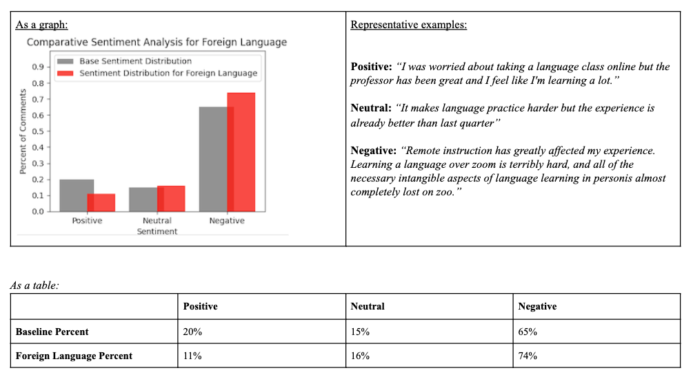

# Survey Sentiment Analysis

## General Description
Based on a university-wide survey of students and their experiences with remote learning.  Students were asked the question, "How has remote instruction affected your experience in this class?"  Student responses were free-form comments in a .pdf file.

NOTE: For privacy reasons, the original file is not included in the repo.

## Goal
Using sentiment analysis, determine areas where students felt relatively more or less positive with their remote-learning experience.  

## Method
Get a baseline of overall distribution of sentiment in three categories (positive, neutral, negative).  From that baseline, compare subsets based on a given topic.  Graph the results.

## Summary

### Classes
#### Labs

#### Foreign Language

### Delivery Format
#### Discussion

#### Lecture

### Platforms
#### Zoom

#### Canvas

### Interpersonal

